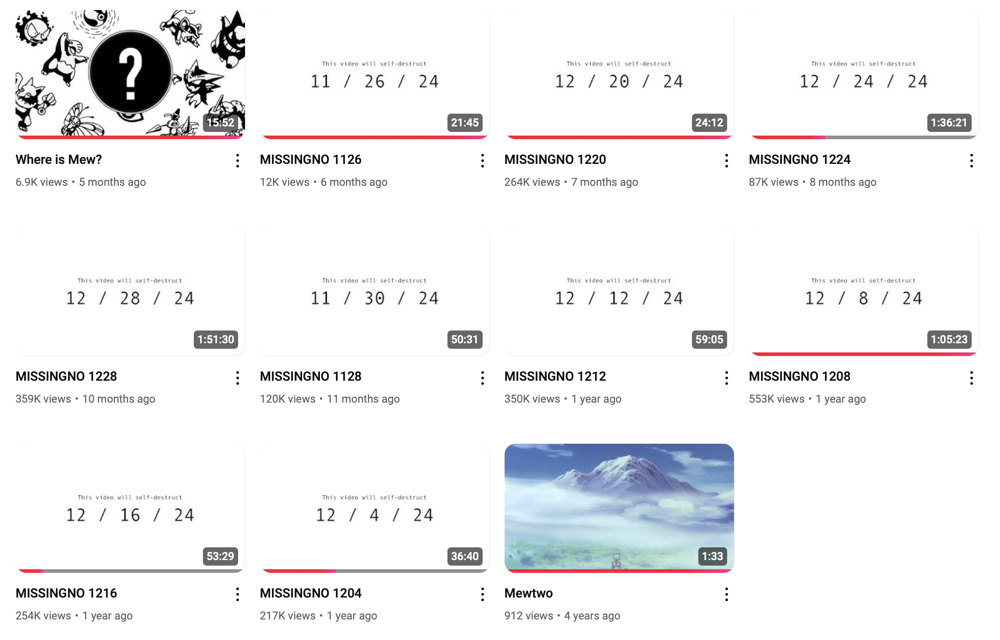

# FlameIsLucky YouTube Channel Archive



In late 2024, [FlameIsLucky](https://www.youtube.com/@FlameIsLucky) started an [ARG](https://en.wikipedia.org/wiki/Alternate_reality_game) related to their [Where is Mew?](https://www.youtube.com/watch?v=m5gbvKpFEpg) video. As part of this ARG, the channel was changed drastically. Video thumbnails were changed and displayed a self-destruct date.

This project is meant to be an archive of metadata for FlameIsLucky's channel and videos. This includes descriptions, video names, and thumbnails.

## Method

Channel data was downloaded with [yt-dlp](https://github.com/yt-dlp/yt-dlp) using the command

```zsh
yt-dlp --get-comments --write-info-json --write-description --write-all-thumbnails https://www.youtube.com/@FlameIsLucky/videos
```

## Archive Dates

All data in this project was archived on November 16th, 2024.

## Layout

### FlameIsLucky Channel

Metadata about the FlameIsLucky channel including channel description and thumbnails.

### readme

Files used in this README, not from FlameIsLucky channel.

### Videos

Each video gets it's own directory. Each directory is named `{video title} [{video id}]`. Each file in the video has the same name.

- `.description.txt` files contains the description of the video
- `.info.json` contains metadata about the video, including comments on the video
- The `Thumbnails` directory contains all possible thumbnails for the video, including thumbnails that appear when scrubbing the video in the YouTube player.

#### Example

The `Where is Mew?` video is stored in `Where is Mew？ [m5gbvKpFEpg]`

where the video id `m5gbvKpFEpg` can be used to view the view on YouTube at <https://www.youtube.com/watch?v=m5gbvKpFEpg>

## Video Files

As the videos are still available on YouTube at the time of writing, I do not feel comfortable including videos files in this project. Please watch the videos on the [FlameIsLucky YouTube Channel](https://www.youtube.com/@FlameIsLucky). They are excellent.
